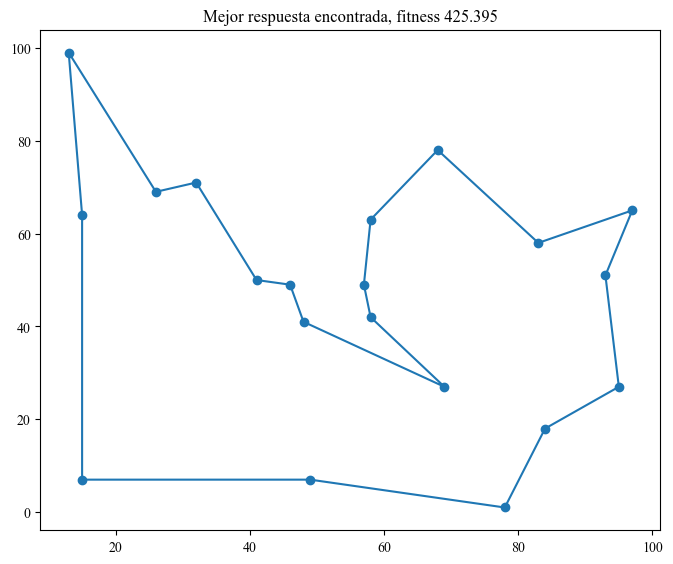
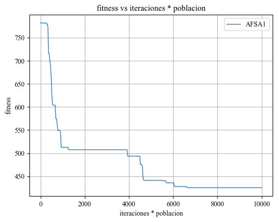
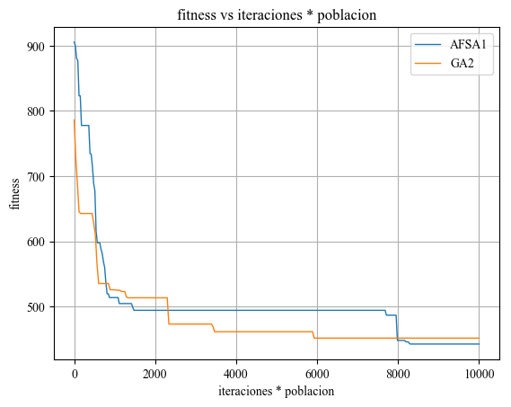

Inicio
======

Ejecución simple
----------------

Para poder resolver cualquiera de los problemas se debe empezar por importar el modulo Optimizar el cual posee todas
las funciones necesarias para poder establecer el problema, el algoritmo y un post procesado de los resultados::
	
	import Optimizar

Luego se debe instanciar un optimizador, el cual es un objeto de la clase Optimizar dentro del módulo Optimizar,
después, se escoge el problema a resolver y el algoritmo a utilizar, además, se deben cargar los parámetros del algoritmo,
esto se puede hacer con la función set_parameters o creando un diccionario con los parámetros correspondientes::
	
	optimizador = Optimizar.Optimizar()
	Problema = optimizador.set_problem('TSP', vector_len=20, size_space=100, dimension=2)
	instanciador, a_name = optimizador.set_algorithm(class_object='AFSA')
	Parametros = optimizador.set_parameters('standar_AFSA.txt')
	
Finalmente, inicializamos el algoritmo usando como parámetros a Parametros y Problema, ambos son diccionarios, así que podemos
realizar un unpack de ambos, para empezar el proceso de optimización, hacemos un llamado a la función del algoritmo empezar(),
a esta función se le puede enviar el parámetro show_results, el cual por defecto es True y habilita la impresión del resultado,
para procesar los resultados obtenidos podemos utilizar la función procesar() del optimizador::
	
	Algoritmo = instanciador(**Parametros, **Problema)
	fitness_evolution, objeto, metrica = Algoritmo.empezar(show_results=True)
	optimizador.procesar(fitness_data=fitness_evolution, best_finded=objeto, metrica=metrica, algoritmo=a_name)

Para el problema del agente viajero los resultados son los siguientes::
	
	Tiempo transcurrido: 1.508
	Problema: TSP
	Ciudades base:[(32, 71), (83, 58), (57, 49), (48, 41), (95, 27), (69, 27), (58, 63), (68, 78), (84, 18), (15, 64), (97, 65), (41, 50), (93, 51), (49, 7), (26, 69), (46, 49), (15, 7), (58, 42), (78, 1), (13, 99)]
	Recorrido:[(32, 71), (41, 50), (46, 49), (48, 41), (69, 27), (58, 42), (57, 49), (58, 63), (68, 78), (83, 58), (97, 65), (93, 51), (95, 27), (84, 18), (78, 1), (49, 7), (15, 7), (15, 64), (13, 99), (26, 69), (32, 71)]
	Fitness: 425.39469168944396

   
   Recorrido encontrado.
   

   
   Grafica del fitness.
	
Código completo::
	
	import matplotlib.pyplot as plt
	import Optimizar

	optimizador = Optimizar.Optimizar()
	Problema = optimizador.set_problem('TSP', vector_len=20, size_space=100, dimension=2)
	instanciador, a_name = optimizador.set_algorithm(class_object='AFSA')
	Parametros = optimizador.set_parameters('standar_AFSA.txt')

	Algoritmo = instanciador(**Parametros, **Problema)
	fitness_evolution, objeto, metrica = Algoritmo.empezar(show_results=True)
	optimizador.procesar(fitness_data=fitness_evolution, best_finded=objeto, metrica=metrica, algoritmo=a_name)

	plt.xlabel('iteraciones * poblacion')
	plt.ylabel('fitness')
	plt.title('fitness vs iteraciones * poblacion')
	plt.legend()
	plt.grid()
	plt.show()
	
Ejecución alterna
-----------------

Se puede reducir la verbosidad del código si conoce el funcionamiento exacto de los módulos, por tanto, se muestra
una forma alterna de realizar el mismo ejemplo anterior::
	
	Resultado = instanciador(**Parametros, **Problema).empezar(show_results=True)
	optimizador.procesar(*Resultado, a_name)

El código final es más compacto a costa de explicites, se deja a manos del lector la elección de cual forma utilizar.
	
Código completo::

	import matplotlib.pyplot as plt
	import Optimizar

	optimizador = Optimizar.Optimizar()
	Problema = optimizador.set_problem('TSP', vector_len=20, size_space=100, dimension=2)
	instanciador, a_name = optimizador.set_algorithm(class_object='AFSA')
	Parametros = optimizador.set_parameters('standar_AFSA.txt')

	Resultado = instanciador(**Parametros, **Problema).empezar(show_results=True)
	optimizador.procesar(*Resultado, a_name)

	plt.xlabel('iteraciones * poblacion')
	plt.ylabel('fitness')
	plt.title('fitness vs iteraciones * poblacion')
	plt.legend()
	plt.grid()
	plt.show()

Ejecución múltiple en secuencia
-------------------------------

Podemos realizar múltiples ejecuciones del mismo algoritmo, bien sea para un mismo problema o para distintos,
con el siguiente código se puede ejecutar n veces el algoritmo escogido para un mismo problema, en este caso, 5 veces::
	
	best_solution = []
	for _ in range(5):   # Numero de ejecuciones secuenciales
		Resultado = instanciador(**Parametros, **Problema).empezar(show_results=True)
	 	optimizador.procesar(*Resultado, a_name)
		best_solution.append(Resultado[1])

	best_solution = General.getbestsolution(best_solution)
	print(f'Mejor solucion: {best_solution.position}\ncon fitness de : {best_solution.fitness}')
	
.. figure:: imagenes/multiplefitness.png
   :scale: 100 %
   :alt: Grafica del fitness
   
   Grafica del fitness para las distintas pruebas.	
	
Código completo::
	
	import matplotlib.pyplot as plt
	from funciones_generales import General
	import Optimizar

	optimizador = Optimizar.Optimizar()
	Problema = optimizador.set_problem('TSP', vector_len=20, size_space=100, dimension=2)
	instanciador, a_name = optimizador.set_algorithm(class_object='AFSA')
	Parametros = optimizador.set_parameters('standar_AFSA.txt')

	best_solution = []
	for _ in range(5):   # Numero de ejecuciones secuenciales
		Resultado = instanciador(**Parametros, **Problema).empezar(show_results=True)
		optimizador.procesar(*Resultado, a_name)
		best_solution.append(Resultado[1])

	best_solution = General.getbestsolution(best_solution)
	print(f'Mejor solucion: {best_solution.position}\ncon fitness de : {best_solution.fitness}')

	plt.xlabel('iteraciones * poblacion')
	plt.ylabel('fitness')
	plt.title('fitness vs iteraciones * poblacion')
	plt.legend()
	plt.grid()
	plt.show()
	
Ejecución múltiple en paralelo
------------------------------

Haciendo uso de la librería multiprocessing podemos correr dos algoritmos al mismo tiempo para resolver el mismo problema
o uno distinto a gusto, la clave se encuentra en instanciar dos algoritmos::
	
	# Se establecen los algoritmos a usar
	instanciador1, a_name1 = optimizador.set_algorithm(class_object='AFSA')
	instanciador2, a_name2 = optimizador.set_algorithm(class_object='GA')
	
	# Primera opcion para cargar parametros al algoritmo: usando un archivo
	Parametros1 = optimizador.set_parameters('standar_AFSA.txt')
	Parametros2 = optimizador.set_parameters('standar_GA.txt')
	
Luego se haciendo uso de la librería multiprocessing podemos crear dos colas para retornar la información de los resultados
en cada thread, además, se establecen los procesos a correr::
	
	# Colas
	q1 = Queue()
	q2 = Queue()
	
	# Se instancian ambos algoritmos enviando los parametros y el problema haciendo un unpack de los diccionarios
	ejecutar1 = instanciador1(**Parametros1, **Problema1)
	ejecutar2 = instanciador2(**Parametros2, **Problema1)
	
	# Se define la ejecucion de los procesos para ambos algoritmos enviando la cola para retornar informacion
	p1 = Process(target=ejecutar1.empezar, kwargs=dict(queue=q1, show_results=False))
	p2 = Process(target=ejecutar2.empezar, kwargs=dict(queue=q2, show_results=False))
	
Finalmente se ejecutan los procesos y se procesan cuando hayan terminado para luego continuar con el proceso principal
utilizando las funciones join()::

	# Se inician los procesos
	p1.start()
	p2.start()
	
	# Cuando cada algoritmo termine, se obtienen los datos de la cola y se procesan
	optimizador.procesar(*q1.get(), a_name1)
	optimizador.procesar(*q2.get(), a_name2)
	
	p1.join()
	p2.join()
	

   
   Grafica del fitness de ambos algoritmos.
   
Código completo::
	
	from multiprocessing import Queue, Process
	from matplotlib import pyplot as plt
	from Optimizar import Optimizar

	if __name__ == '__main__':
		
		# Instanciacion de un Optimizador
		optimizador = Optimizar()
		
		# Definicion del problema
		Problema1 = optimizador.set_problem('TSP', vector_len=20, size_space=100, dimension=2)
		
		# Se establecen los algoritmos a usar
		instanciador1, a_name1 = optimizador.set_algorithm(class_object='AFSA')
		instanciador2, a_name2 = optimizador.set_algorithm(class_object='GA')
		
		# Primera opcion para cargar parametros al algoritmo: usando un archivo
		Parametros1 = optimizador.set_parameters('standar_AFSA.txt')
		Parametros2 = optimizador.set_parameters('standar_GA.txt')
		
		# Colas
		q1 = Queue()
		q2 = Queue()
		
		# Se instancian ambos algoritmos enviando los parametros y el problema haciendo un unpack de los diccionarios
		ejecutar1 = instanciador1(**Parametros1, **Problema1)
		ejecutar2 = instanciador2(**Parametros2, **Problema1)
		
		# Se define la ejecucion de los procesos para ambos algoritmos enviando la cola para retornar informacion
		p1 = Process(target=ejecutar1.empezar, kwargs=dict(queue=q1, show_results=False))
		p2 = Process(target=ejecutar2.empezar, kwargs=dict(queue=q2, show_results=False))
		
		# Se inician los procesos
		p1.start()
		p2.start()
		
		# Cuando cada algoritmo termine, se obtienen los datos de la cola y se procesan
		optimizador.procesar(*q1.get(), a_name1)
		optimizador.procesar(*q2.get(), a_name2)
		
		p1.join()
		p2.join()
		
		# Opciones para la grafica creada con optimizador.procesar()
		plt.xlabel('iteraciones * poblacion')
		plt.ylabel('fitness')
		plt.title('fitness vs iteraciones * poblacion')
		plt.legend()
		plt.grid()
		plt.savefig("imagenes\\fitnessgraph.png", bbox_inches='tight', pad_inches=0.1, format='png')
		plt.show()
